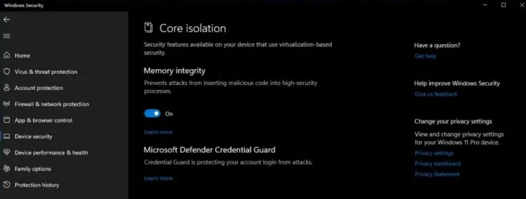

# Healthnect

## Required Software and Dependencies

- [Kinect for Windows SDK v1.8](https://www.microsoft.com/en-us/download/details.aspx?id=40278&msockid=1321a2ed8034635317ebb69281ed623a)
- [Kinect Developer Tools for Windows](https://www.microsoft.com/en-us/download/details.aspx?id=40276)

## Settings

In order to run the Kinect drivers for Windows, you need to disable Core Isolation Memory Integrity. This option can be accessed in "Settings" > "Security Settings" > "Device Security" > "Core Isolation"

